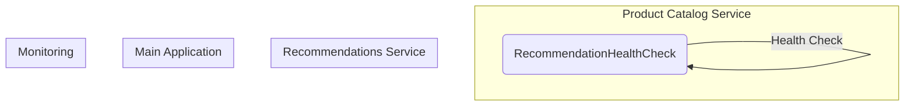

```mermaid
flowchart TB
    subgraph "Product Catalog Service"
        id("ProductCatalog") -->|HTTP Request| id("ProductCatalogController")
        id("ProductCatalogController") -->|Database Query| id("ProductCatalogDB")
        id("ProductCatalogController") -->|HTTP Request| id("RecommendationController")
        id("RecommendationController") -->|HTTP Request| id("RecommendationsService")
    end

    subgraph "Recommendations Service"
        id("RecommendationsService") -->|HTTP Request| id("ProductCatalogService")
        id("RecommendationsService") -->|Database Query| id("RecommendationsDB")
    end

    subgraph "Main Application"
        id("MainApplication") -->|HTTP Request| id("ProductCatalogController")
        id("MainApplication") -->|HTTP Request| id("RecommendationController")
    end

    subgraph "Monitoring"
        id("ProductCatalogController") -->|Health Check| id("ProductCatalogHealthCheck")
        id("RecommendationController") -->|Health Check| id("RecommendationHealthCheck")
    end
```